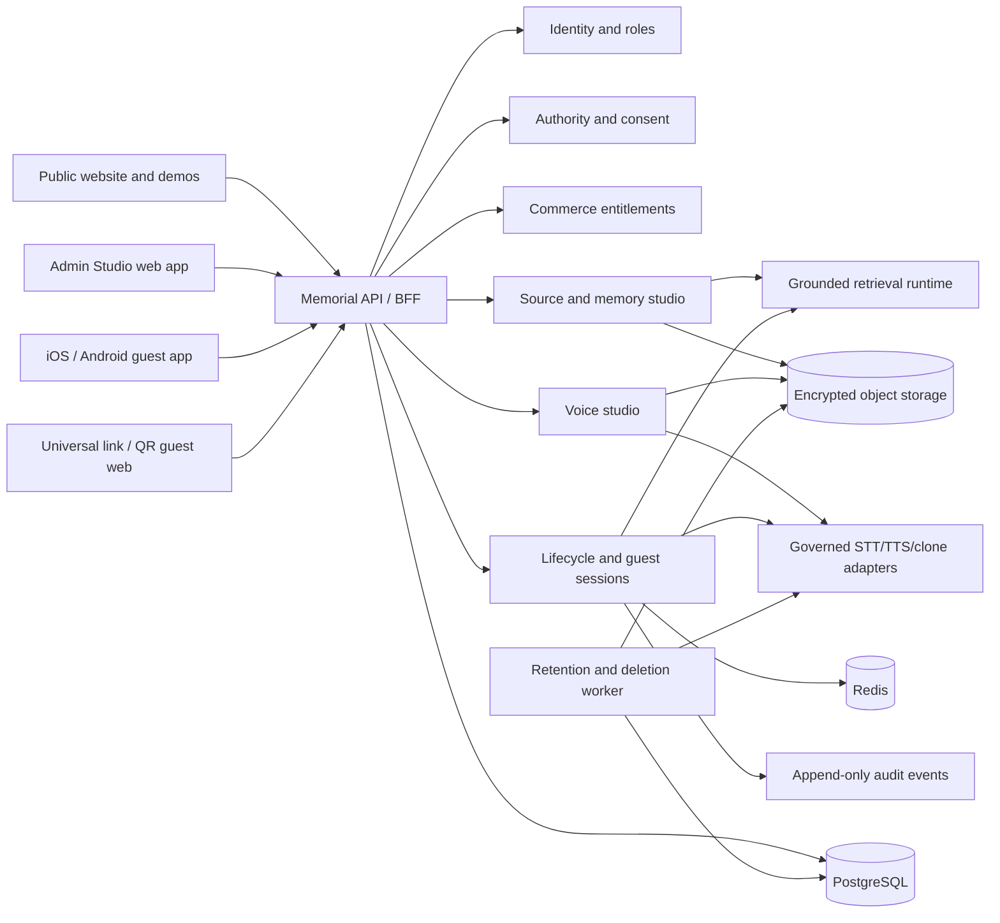

# Memorial Product and Repository Design

| Field | Value |
| --- | --- |
| Status | Accepted design baseline |
| Date | 2026-07-31 |
| Owners | Memorial product owner and operator |
| Source repository | `executive-assistant` |
| Target repositories | `/docker/EA` (`EA_CORE`) and `/docker/Memorial` (`MEMORIAL`) |
| Deployment posture | Local Docker; no GitHub Actions |

## 1. Decision

Memorial becomes an independent product and repository.

`/docker/EA` remains the Executive Assistant control-plane product and loses
Memorial routes, data, deployment modes, provider credentials, release
authority, and product claims after the standalone Memorial runtime passes its
cutover gates.

`/docker/Memorial` becomes the sole owner of the Memorial customer experience,
commercial packages, authority and consent records, source-grounded persona
profiles, voice profiles, guest access, retention, deletion, and Memorial
release evidence.

The split is a repository and runtime boundary, not merely a feature flag.
EA Core and Memorial must not share a database, Redis instance, writable
volume, session secret, provider credential, deployment unit, or public route.

The current Manfred deployment remains unchanged until the extracted runtime
has passed its standalone release gates. The migration fails closed: no route
is removed from EA before the replacement is verified.

## 2. Product promise

Memorial is a time-bounded, source-grounded remembrance experience. It lets an
authorized organizer curate real memories, prepare a clearly disclosed
synthetic voice, and invite family or friends to a limited conversation
experience.

Memorial:

- does not claim that the deceased person is present;
- does not claim to know facts absent from approved sources;
- does not diagnose grief or create a psychological diagnosis;
- does not market itself as psychotherapy or a substitute for professional
  support;
- does not optimize for dependency, session length, or repeated purchasing;
- does not initiate messages in the reconstructed person's voice;
- does not silently renew, extend, or preserve an interactive reconstruction;
- does not use customer sources or voices to train general-purpose models.

The user-facing term for the generated subject model is **source-grounded
memory profile**, not "psychological profile."

## 3. Product forms

The product is sold as distinct one-time packages. Duration is only one policy
dimension; a long package is not an event package with a larger expiry value.

Initial catalog candidates are:

| Product | Intended use | Example active window | Character |
| --- | --- | ---: | --- |
| Ceremony | Funeral, wake, or one gathering | 24-72 hours | Event-focused, many short guest sessions |
| Farewell Month | Distributed family access after a ceremony | 30 days | Moderate guest access and curator revisions |
| Remembrance Season | A bounded family remembrance period | 90 days | Lower-frequency conversations and more curation |
| Family Season | A larger or geographically distributed family | 180 days | Multiple curators, strict per-person pacing |
| Advance Legacy | A living person prepares their future memorial | Configurable | Direct consent, recording, topic, delegate, and expiry rules |

Durations and quotas are catalog data, not application constants. A
`PackagePolicy` defines:

- preparation window;
- activation rules;
- active and read-only windows;
- participant and curator limits;
- storage and source limits;
- voice sample, build, test, and synthesis budgets;
- per-session, per-day, and per-user conversation limits;
- number of publishable voice and memory-profile versions;
- export availability;
- deletion schedule;
- extension eligibility.

There is no automatic renewal. Extending access requires a separate, explicit
purchase and a new confirmation of the final date. The UI must never use the
reconstructed voice to sell an extension.

## 4. Users and authority

### 4.1 Roles

| Role | Authority |
| --- | --- |
| Purchaser | Billing, receipt, refund, and package activation |
| Memorial owner | Legal/organizational authority and final publication |
| Curator | Sources, memories, exclusions, and profile drafts |
| Voice editor | Voice samples, tuning, tests, and version drafts |
| Event host | Guest access, event state, pause, and emergency stop |
| Contributor | Own submitted memories and permission withdrawal |
| Guest | Time-bounded conversation and approved memory viewing |
| Support operator | Metadata-level diagnostics and governed freeze actions |

Purchaser and Memorial owner may be different people. A successful payment
never substitutes for authority to reconstruct a person.

### 4.2 Authority gate

Every Memorial has an `AuthorityCase`. Publication remains blocked until the
case contains:

- the requester's asserted relationship and authority;
- the lawful or contractual basis selected for the target jurisdiction;
- provenance and permitted use of every voice sample;
- contributor terms for living people;
- audience and duration decisions;
- an owner declaration that synthetic generation is understood;
- a review outcome and immutable receipt.

The system needs a visible objection flow. A credible family or rights dispute
creates a `DisputeHold`, immediately blocks new guest sessions and new
synthesis, preserves only the minimum evidence required to resolve the case,
and prevents deletion jobs from destroying evidence while the hold is valid.
Only an authorized resolution may release the hold.

Advance Legacy is the preferred authority path: a living person records their
own voice and memories and appoints delegates, audiences, forbidden subjects,
durations, and deletion rules.

## 5. Experience architecture



### 5.1 Client surfaces

The first product is a responsive web application with installable PWA
behavior. It is the fastest way to prove admin workflows, guest links, kiosk
mode, and payments without duplicating product logic.

Native iOS and Android clients follow the same BFF contract. They must remain
thin clients: entitlement decisions, lifecycle enforcement, provider
credentials, retrieval, and generated-audio authority stay on the server.

Guests must not be forced to install an app at a funeral. A QR code opens a
universal HTTPS link; an installed app may claim that link, while every core
guest flow remains available in the browser.

### 5.2 Accessibility and event resilience

Required guest capabilities:

- text and voice input;
- captions and transcript controls;
- keyboard and screen-reader support;
- reduced-motion mode;
- high-contrast and scalable type;
- headphone/privacy prompt;
- a large-touch kiosk mode;
- approved static memory cards and original recordings as an offline fallback.

The system must not simulate a successful AI conversation while disconnected.
It switches explicitly to the static remembrance fallback.

## 6. Public demonstration system

The public demo is an isolated tenant and provider budget. It never reads
customer Memorials.

It contains:

1. short listening comparisons;
2. interactive conversations with fictional or explicitly licensed demo
   personas;
3. a read-only or budget-limited Voice Studio demonstration;
4. a source-grounding demonstration that exposes approved citations and honest
   abstention.

Listening works without an account. Interactive demos use short-lived
anonymous sessions, aggressive rate and cost limits, and automated transcript
deletion. Demo analytics capture technical and funnel events, not raw
conversation text by default.

The existing Manfred public-evaluation permission must not be interpreted as a
commercial advertising license. Manfred may become a commercial demo only
after a separate documented grant.

## 7. Admin Studio

The Admin Studio has two related but separate workspaces.

### 7.1 Memory Studio

The Memory Studio lets curators:

- upload and classify sources;
- inspect transcription and OCR;
- separate living correspondents from subject material;
- redact private passages;
- approve evidence-backed claims;
- mark uncertainty and contradictory accounts;
- define forbidden and sensitive subjects;
- edit an allowed style profile without inventing facts;
- review source coverage;
- run a golden question set;
- approve a version for publication.

Every generated answer must either cite an approved claim/source segment or
abstain with product-approved language. Retrieval confidence alone is never
permission to publish a claim.

### 7.2 Voice Studio

The Voice Studio provides:

- waveform and aligned transcript;
- speaker diarization and exclusion of other speakers;
- clipping, noise, reverberation, silence, and quality diagnostics;
- non-destructive derived cleanup previews;
- per-segment include/exclude decisions;
- language, dialect, pace, stability, similarity, warmth, expression, and
  pause controls where the selected provider supports them;
- a pronunciation dictionary for names, places, and family terms;
- provider-neutral test scripts;
- A/B comparison with approved reference recordings;
- version history, approval, publication, rollback, and revocation.

Actual model retraining and inference-time parameter tuning are distinct jobs.
The UI may call both "voice refinement" but the audit record must identify
which occurred.

The state machine is:

```text
DRAFT -> ANALYZING -> BUILDING -> QA -> APPROVED -> PUBLISHED
                                      \-> REJECTED
PUBLISHED -> REVOKED -> DELETION_PENDING -> DELETED
```

No provider build becomes public automatically. A human with publication
authority must hear and approve the exact `VoiceProfileVersion`.

An active conversation pins one voice version for its entire session. New
versions affect only new sessions. Rollback changes the version selected for
future sessions and does not rewrite historical audit events.

## 8. Ingestion

### 8.1 Initial release

The first release supports deliberate upload of:

- audio and video;
- images;
- PDF and office documents;
- plain text;
- exported mail threads selected by the user.

Every file passes size/type validation, malware scanning, extraction,
provenance capture, deduplication, and a human approval step.

### 8.2 Gmail and IMAP

Gmail OAuth is selective. The user chooses labels, threads, senders, or date
ranges before import and sees an import preview. Tokens are encrypted in a
credential vault, scope is minimized, access can be revoked in the product,
and incremental sync is off by default.

Generic IMAP follows after Gmail and uses provider-specific OAuth or app
passwords stored only in the vault. POP3 is excluded from the first commercial
release because it lacks the folder, state, and selective-sync semantics needed
for safe ingestion.

The importer treats living correspondents as first-class data subjects.
Content about health, religion, sexuality, finances, minors, criminal matters,
or family conflict is private by default and requires explicit curator action.

## 9. Conversation and safety policy

Every guest session begins with visible and spoken disclosure that the guest is
interacting with an AI reconstruction based on selected sources.

The interface retains an always-visible "AI reconstruction" label. Generated
audio exports carry synthetic-media metadata and a watermark when supported.

The runtime must:

- answer only from the approved profile and sources;
- expose a source card or an honest absence statement;
- avoid claiming current consciousness, feelings, wishes, or observation;
- avoid instructions presented as the deceased person's present authority;
- refuse medical, legal, financial, and crisis counseling in persona;
- never express guilt, jealousy, abandonment, or pressure to return;
- never ask the guest to pay, extend access, hide use, or withdraw from people;
- never send proactive persona notifications;
- provide pause, mute, text-only, end-session, and report controls;
- route acute-risk language to a neutral safety response and real-world help,
  outside the reconstructed persona.

Long packages add per-person frequency limits, regular disclosure
reconfirmation, a visible end date, and private usage controls. Product success
is not measured by time spent talking.

Minors require a dedicated policy, guardian controls, age-appropriate copy,
and stricter interaction limits before they are supported.

## 10. Lifecycle enforcement

The canonical state machine is:

```text
DRAFT
  -> AUTHORITY_PENDING
  -> INGESTING
  -> CURATING
  -> VOICE_REVIEW
  -> READY
  -> SCHEDULED
  -> LIVE
  -> READ_ONLY
  -> CLOSED
  -> PURGE_PENDING
  -> PURGED
```

Additional terminal/holding states are `CANCELLED`, `DISPUTE_HOLD`, and
`SAFETY_FROZEN`.

The server stores `starts_at`, `live_until`, `read_only_until`, and `purge_at`
in UTC together with the display timezone. The following all enforce expiry:

- the HTTP BFF before every turn;
- the WebSocket handshake and every WebSocket turn;
- Redis session TTL;
- provider job dispatch;
- a scheduler that revokes active sessions;
- a reconciliation worker that finds missed transitions.

The synchronous request check is authoritative. Scheduler failure can delay
cleanup but can never extend conversation access.

At `live_until`, the system rejects new turns, closes active realtime sessions,
cancels queued synthesis, revokes share tokens, and blocks provider dispatch.
At `purge_at`, it destroys the per-Memorial data-encryption key, deletes
objects and derived data, requests provider-side clone deletion, and emits a
`DeletionReceipt`. Billing and legally required transaction records remain
separate and contain no conversation or source content.

## 11. Commerce and entitlements

Commerce is server-authoritative.

Web checkout and store checkout produce normalized `PurchaseRecord` events.
Provider webhooks and store notifications are verified, idempotent, replay
protected, and reconciled. A purchase grants an immutable
`PackageEntitlement`; activation creates the scheduled lifecycle timestamps.

Apple packages are represented using the store product type suitable for
limited-duration, non-auto-renewing service access. Google packages use
one-time products or the applicable non-renewing/prepaid product type at
implementation time. Store terminology must not change the user-facing promise:
there is no automatic renewal.

The checkout shows:

- exact preparation, active, read-only, and deletion dates or calculation
  rules;
- included voice and conversation budgets;
- participant and curator limits;
- provider-dependent limitations;
- refund and activation policy;
- what is retained after closure;
- whether an explicit later package can reopen the same source collection.

No in-conversation microtransactions or emotionally framed scarcity are
allowed. Quota exhaustion produces a neutral message to the organizer, never a
statement in the reconstructed voice.

## 12. Data model

The first canonical relational model includes:

- `Account`
- `Identity`
- `Memorial`
- `MemorialSubject`
- `MemorialMembership`
- `AuthorityCase`
- `ConsentReceipt`
- `DisputeHold`
- `PackageDefinition`
- `PurchaseRecord`
- `PackageEntitlement`
- `MemorialLifecycle`
- `SourceAsset`
- `SourceSegment`
- `SourcePermission`
- `SourceClaim`
- `MemoryProfileVersion`
- `VoiceSample`
- `VoiceProfileVersion`
- `PronunciationEntry`
- `VoiceTestRun`
- `ShareInvite`
- `GuestSession`
- `ConversationTurn`
- `SafetyEvent`
- `ContentReport`
- `AuditEvent`
- `RetentionPolicy`
- `DeletionJob`
- `DeletionReceipt`

PostgreSQL owns transactional metadata. S3-compatible object storage owns
encrypted source and derived media. Redis owns disposable sessions, rate
limits, concurrency leases, and warm caches. Provider identifiers are opaque
references bound to a Memorial and version; they are never returned to guests.

Every row and object belongs to a tenant and Memorial. Authorization is checked
at the repository/service boundary, not only in routes. Support access is
metadata-only by default and requires an audited elevation for content.

## 13. API boundary

Representative versioned routes:

```text
GET  /v1/catalog/packages
POST /v1/commerce/purchases/verify
POST /v1/commerce/webhooks/{provider}

POST /v1/memorials
GET  /v1/memorials/{id}
POST /v1/memorials/{id}/authority
POST /v1/memorials/{id}/activate
POST /v1/memorials/{id}/freeze

POST /v1/memorials/{id}/sources
GET  /v1/memorials/{id}/claims
POST /v1/memorials/{id}/profiles
POST /v1/memorials/{id}/profiles/{version}/approve

POST /v1/memorials/{id}/voice/samples
POST /v1/memorials/{id}/voice/analyze
POST /v1/memorials/{id}/voice/versions
POST /v1/memorials/{id}/voice/test
PUT  /v1/memorials/{id}/voice/pronunciations
POST /v1/memorials/{id}/voice/versions/{version}/approve
POST /v1/memorials/{id}/voice/versions/{version}/publish
POST /v1/memorials/{id}/voice/versions/{version}/revoke

POST /v1/memorials/{id}/invites
DELETE /v1/memorials/{id}/invites/{invite}
POST /v1/guest/sessions
POST /v1/guest/sessions/{session}/turns
GET  /v1/guest/sessions/{session}/events
POST /v1/guest/sessions/{session}/reports

GET  /v1/demo/personas
POST /v1/demo/sessions
POST /v1/demo/sessions/{session}/turns

GET  /v1/memorials/{id}/retention
POST /v1/memorials/{id}/export
POST /v1/memorials/{id}/delete
GET  /v1/memorials/{id}/deletion-receipt
```

Provider APIs remain behind internal adapters. Clients cannot choose raw voice
IDs, models, system prompts, source paths, or provider credentials.

## 14. Identity, privacy, and security

Required controls:

- passkeys or MFA for owners and privileged editors;
- short-lived guest capabilities stored as hashes;
- device/session revocation;
- CSRF protection and secure same-site cookies for web;
- PKCE for mobile OAuth;
- Sign in with Apple alongside Google login where store policy requires it;
- in-app and web account-deletion paths;
- per-Memorial envelope encryption;
- credential vault for OAuth and provider secrets;
- signed, short-lived object URLs;
- strict upload validation and malware scanning;
- tenant isolation tests;
- rate, concurrency, storage, and cost limits;
- append-only security and publication audit events;
- no source text, transcript, token, provider ID, or voice sample in ordinary
  application logs;
- data-processing inventory and provider deletion contracts;
- privacy and AI-transparency notices versioned with acceptance receipts.

Memorial must complete a jurisdiction-specific legal review before public sale.
The fact that GDPR does not directly protect a deceased person's data does not
remove obligations concerning living correspondents, contributors, children,
communications, copyright, personality rights, consumer rights, or national
post-mortem rules.

## 15. Store and moderation readiness

Before public mobile submission, the product includes:

- a complete reviewer demo account or approved built-in demo;
- functional store products and server receipt verification;
- purchase restoration and refund/revocation reconciliation;
- visible privacy policy and retention policy;
- account and data deletion;
- data-safety and privacy-label inventories;
- in-app generated-content reporting;
- source/report review tooling and response targets;
- user and invite blocking where applicable;
- age rating and minor restrictions;
- synthetic voice and direct-AI-interaction disclosure.

Store policy checks are a release gate, not a post-launch task.

## 16. Local Docker topology

The production-like local stack is independent from EA:

```text
memorial-web
memorial-api
memorial-worker
memorial-scheduler
memorial-postgres
memorial-redis
memorial-objects
memorial-ingress
```

Optional provider emulators are available only in development/test profiles.

Rules:

- one immutable revision-bound application image;
- separate least-privilege processes for API, worker, and scheduler;
- read-only containers where possible;
- no Docker socket;
- no host networking by default;
- explicit health and readiness checks;
- secrets mounted at runtime, never committed or copied from EA;
- named volumes prefixed `memorial_`;
- a dedicated network;
- local build, test, migration, backup, restore, smoke, and deployment commands;
- no GitHub Actions dependency.

Suggested operator commands:

```text
make bootstrap
make dev
make test
make security-gates
make release-image
make release-preflight
make deploy-local
make smoke-local
make backup-test
make deletion-test
```

Mobile artifacts are built from a controlled local release workstation or
another explicitly governed build service. The backend remains locally hosted
in Docker behind the approved public ingress.

## 17. Repository split

### 17.1 Final ownership

`/docker/EA` owns:

- executive morning brief, decisions, commitments, approvals, and audit;
- EA channels and office integrations;
- EA provider routing and operator tooling;
- EA product surfaces and release evidence.

`/docker/Memorial` owns:

- all `/memorials/*` and Memorial API routes;
- public demo and guest surfaces;
- Memory Studio and Voice Studio;
- Memorial accounts, roles, packages, entitlements, lifecycle, and deletion;
- Memorial source, voice, contribution, and runtime data;
- Memorial-only provider adapters and credentials;
- Memorial deployment, tests, runbooks, and release evidence.

There is no runtime dependency from Memorial to EA. If both products later need
a neutral provider adapter or pure contract, it must become a small versioned
package with an explicit owner rather than a shared source directory.

### 17.2 Initial extraction inventory

The extraction inventory starts with:

- `ea/app/api/routes/public_memorial*.py`;
- `ea/app/api/routes/memorial_memory_room.py`;
- `ea/app/api/routes/memory_memorial.py`;
- `ea/app/domain/memorial/`;
- `ea/app/services/memorial*.py`;
- Memorial-only voice signing, voice review, and provider helpers discovered by
  import analysis;
- `ea/app/templates/admin_memorial_gold.html` and all public Memorial HTML/CSS/
  JavaScript currently embedded in route modules;
- `memorial_data/`;
- `memorial_archive/`;
- Memorial scripts under `ea/scripts/` and repository `scripts/`;
- Memorial unit, contract, browser, deployment, security, voice, and operator
  tests;
- `docker-compose.memorial.yml`;
- `deploy/manfred-memorial/`;
- Memorial runbooks and release-gate documents;
- Memorial-generated evidence schemas that remain product truth.

The existing `public_memorials.py` is a compatibility monolith, not the target
architecture. Extraction decomposes it into routes, application services,
provider adapters, repositories, and UI assets. It must not become the new
repository's permanent center.

### 17.3 Cross-dependency rule

Every imported EA module found during extraction is classified:

1. **Memorial-owned:** move it.
2. **Generic and pure:** reimplement behind a small Memorial interface or move
   to a neutral versioned package.
3. **EA-owned:** replace it with a Memorial-owned interface; do not import EA.
4. **Historical/release evidence:** copy only when it is required provenance,
   label it as imported, and make the new repo own future generations.

Secrets, runtime caches, provider token state, customer data, and untracked
artifacts are never copied through Git.

### 17.4 Migration sequence

1. Commit this design and freeze the boundary.
2. Generate a tracked-file/import/test inventory with checksums and provenance.
3. Create `/docker/Memorial` on branch `main` with an independent `.git`.
4. Preserve relevant file history where tooling safely permits it; always emit
   a migration manifest binding source commit, destination commit, file hashes,
   exclusions, and transformations.
5. Establish standalone settings, application factory, Docker stack, database
   migrations, and test runner.
6. Move the existing single-subject Manfred runtime as a compatibility slice.
7. Replace EA-specific names, settings, cookies, schemas, and paths with
   Memorial-owned names while retaining migration readers where needed.
8. Pass parity tests against the existing Manfred candidate without changing
   the live deployment.
9. Add multi-tenant product foundations, studios, entitlement lifecycle, demo,
   and retention controls in the new repo.
10. Deploy a standalone local candidate and pass release gates.
11. Cut public ingress to the standalone runtime with a tested rollback.
12. Remove Memorial route inclusion, feature flags, compose overlay, data
    mounts, secrets, tests, and product claims from EA Core.
13. Prove EA Core still passes its own release gates and returns no Memorial
    routes.

## 18. Migration and release gates

### 18.1 Repository gates

- both repositories have clean `main` branches;
- each repository has independent README, AGENTS instructions, license posture,
  environment example, threat model, runbook, and changelog;
- no `.git` nesting, symlink bridge, shared writable source, or implicit
  relative import;
- provenance manifest matches the source and destination revisions;
- secret scan passes;
- dependency and license inventory passes.

### 18.2 EA Core gates

- no Memorial router imports or runtime feature flags;
- no Memorial environment variables, secrets, data mounts, or compose modes;
- Memorial URLs return the documented not-found response;
- EA Core startup, unit, integration, and local Docker smoke tests pass;
- EA public and authenticated product journeys remain unchanged.

### 18.3 Memorial compatibility gates

- current public Manfred landing and conversation-start behavior match the
  accepted baseline;
- text, STT, TTS, realtime, warmup, source grounding, voice disclosure,
  contribution, sharing, and operator freeze paths pass;
- the pinned voice identity and release receipts remain verifiable;
- provider failure falls back or fails honestly;
- no raw bundle, source path, provider credential, or private profile is public;
- candidate load and browser checks pass at the intended public origin.

### 18.4 Commercial product gates

- purchase verification is idempotent and replay safe;
- entitlement expiry blocks HTTP and realtime turns synchronously;
- revoked invites and sessions cannot reconnect;
- tenant isolation and support elevation tests pass;
- every answer cites approved evidence or abstains;
- publication requires authority, profile, and voice approvals;
- provider clone revocation and deletion are reconciled;
- crypto-shred makes purged content unrecoverable from ordinary backups;
- account deletion works in app and on the web;
- content reporting and operator response work end to end;
- demo data cannot access customer tenants;
- offline fallback never presents generated content as live;
- accessibility, localization, mobile deep links, and kiosk mode pass;
- event-day load, provider outage, scheduler outage, backup, restore, rollback,
  and deletion drills pass.

## 19. Observability and product metrics

Operational telemetry uses opaque tenant, Memorial, session, turn, provider,
and error identifiers. Raw prompts, sources, transcripts, and audio are not
ordinary telemetry.

Primary service metrics:

- availability and event readiness;
- end-to-end turn latency;
- STT, retrieval, generation, and TTS stage latency;
- grounded-answer and honest-abstention rates;
- provider error, timeout, and fallback rates;
- entitlement denial correctness;
- report and dispute response time;
- deletion job age and provider-deletion reconciliation;
- per-package cost and remaining governed budget.

Primary experience metrics:

- successful setup and publication;
- guest session completion without error;
- accessibility task completion;
- source/report correction resolution;
- owner understanding of AI disclosure and deletion dates.

Time spent, number of emotional turns, late-night use, and extension conversion
must not be product-success targets.

## 20. Delivery milestones

### M0 — Boundary and extraction

- canonical design committed;
- new repository created under `/docker`;
- provenance and dependency inventory complete;
- standalone compatibility runtime boots.

### M1 — Safe Manfred parity

- current Memorial behavior and voice authority preserved;
- independent Docker candidate passes browser, voice, security, and rollback
  gates;
- ingress can be switched without touching EA.

### M2 — Commercial web MVP

- accounts and roles;
- authority case;
- one Ceremony package;
- manual source upload;
- Memory Studio;
- Voice Studio;
- QR/link guest access;
- hard expiry, reporting, export, and deletion;
- fictional interactive demo;
- web checkout and receipt verification.

### M3 — Multi-duration product

- 30-, 90-, and 180-day package policies;
- family contributors and multiple curators;
- long-duration pacing and disclosure reconfirmation;
- dispute workflow and operational support console.

### M4 — Mobile and stores

- iOS and Android clients;
- deep links and purchase restoration;
- store billing;
- account deletion;
- moderation, privacy labels, reviewer demo, and store release evidence.

### M5 — Selective connected sources

- Gmail selective import;
- provider-safe IMAP;
- living-correspondent controls;
- incremental sync, revocation, and deletion reconciliation.

### M6 — Advance Legacy

- self-recording and direct consent;
- trusted delegates;
- future-use, topic, audience, duration, and deletion instructions;
- export and portability.

## 21. Explicit non-goals for the first commercial release

- public search or discovery of customer Memorials;
- unrestricted public personas;
- unlimited conversations;
- persona-initiated push, email, or messaging;
- per-minute emotional upselling;
- psychiatric assessment or treatment claims;
- automatic ingestion of an entire mailbox;
- POP3;
- photorealistic realtime avatars or generated video;
- voice model downloads;
- using customer data to improve general models;
- shared EA/Memorial production infrastructure.

## 22. References

- Existing product boundary: `PRODUCT_BOUNDARY.md`
- Existing runtime map: `ARCHITECTURE_MAP.md`
- Existing Memorial brief: `docs/MEMORIAL_EXECUTIVE_BRIEF.md`
- Current Memorial deployment overlay: `docker-compose.memorial.yml`
- Apple App Review Guidelines:
  <https://developer.apple.com/app-store/review/guidelines/>
- Apple In-App Purchase types:
  <https://developer.apple.com/help/app-store-connect/reference/in-app-purchases-and-subscriptions/in-app-purchase-types>
- Google Play AI-generated content policy:
  <https://support.google.com/googleplay/android-developer/answer/13985936>
- Google Play one-time products:
  <https://developer.android.com/google/play/billing/one-time-products>
- EU Artificial Intelligence Act:
  <https://eur-lex.europa.eu/eli/reg/2024/1689/oj>
- EU General Data Protection Regulation:
  <https://eur-lex.europa.eu/eli/reg/2016/679/oj>

## 23. Acceptance of this design

This document is the implementation baseline for the repository split and the
commercial Memorial product. Material changes to ownership, lifecycle,
authority, disclosure, retention, or the prohibition on manipulative
engagement require an explicit design revision before implementation.
